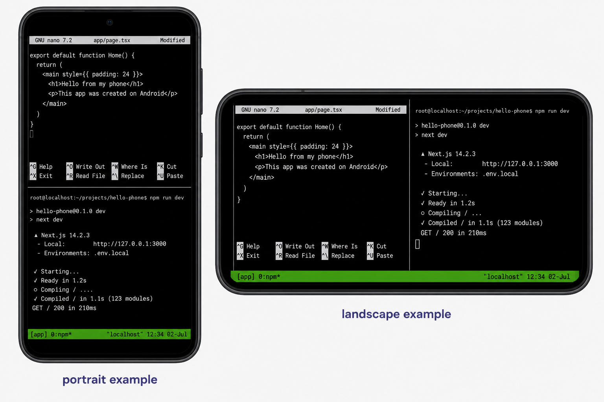

# Terminal Multiplexer (tmux)

tmux lets one terminal act like several terminals. On a phone, use it to keep your editor, dev server, and commands in one place.



- **Portrait example:** top/bottom panes, with the editor above and `npm run dev` below.
- **Landscape example:** left/right panes, with the editor on the left and the dev server on the right.
- **Green bar:** tmux status bar; it shows the session/window and confirms tmux is running.

## Setup

tmux is installed and configured if you followed the installer. If not:

```sh
# In Termux
pkg install tmux

# In Ubuntu
apt install tmux
```

Create `~/.tmux.conf` for mouse/touch support:

```sh
cat > ~/.tmux.conf << 'EOF'
set -g mouse on
set -g history-limit 5000
set -g base-index 1
setw -g pane-base-index 1
EOF
tmux source-file ~/.tmux.conf
```

## Workflow: Editor + Dev Server

Start a session:

```sh
tmux new -s app
```

Open editor:

```sh
code .
```

Split for the dev server. Portrait:

```text
Ctrl+B, then "
```

Landscape:

```text
Ctrl+B, then %
```

Run the dev server:

```sh
npm run dev
```

## Add OpenCode Safely

Open another pane or tmux window, then start OpenCode inside the project:

```sh
cd ~/projects/my-app
ocode --auto
```

Avoid starting OpenCode from `/root`, `~`, or `~/projects`.

## Shortcuts

| Shortcut | Action |
| --- | --- |
| `Ctrl+B`, then `"` | Split top/bottom |
| `Ctrl+B`, then `%` | Split left/right |
| `Ctrl+B`, then arrow key | Move between panes |
| `Ctrl+B`, then `z` | Zoom current pane |
| `Ctrl+B`, then `x` | Close current pane |
| `Ctrl+B`, then `d` | Detach and leave session running |

## Detach And Reattach

Detach:

```text
Ctrl+B, then d
```

List sessions:

```sh
tmux ls
```

Reattach:

```sh
tmux attach -t app
```

If Android kills Termux, tmux dies too. Detach helps when you switch apps briefly; it is not a replacement for commits.
